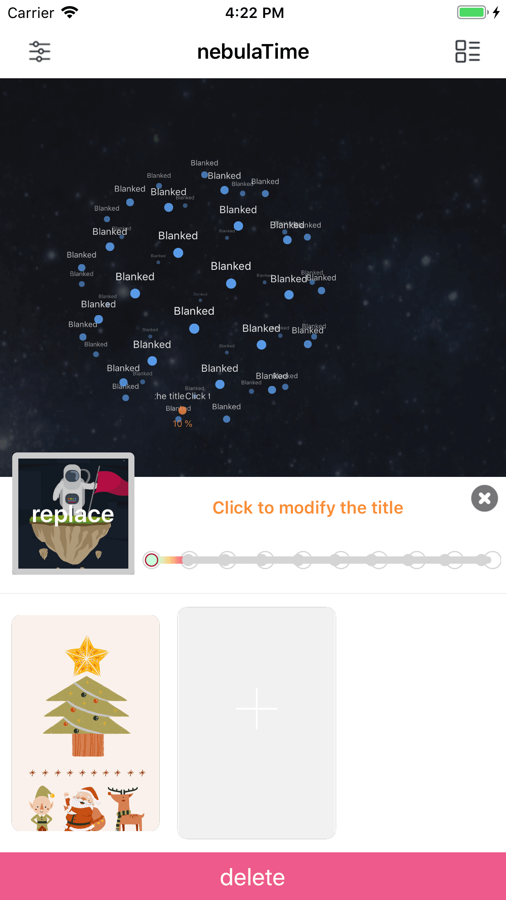
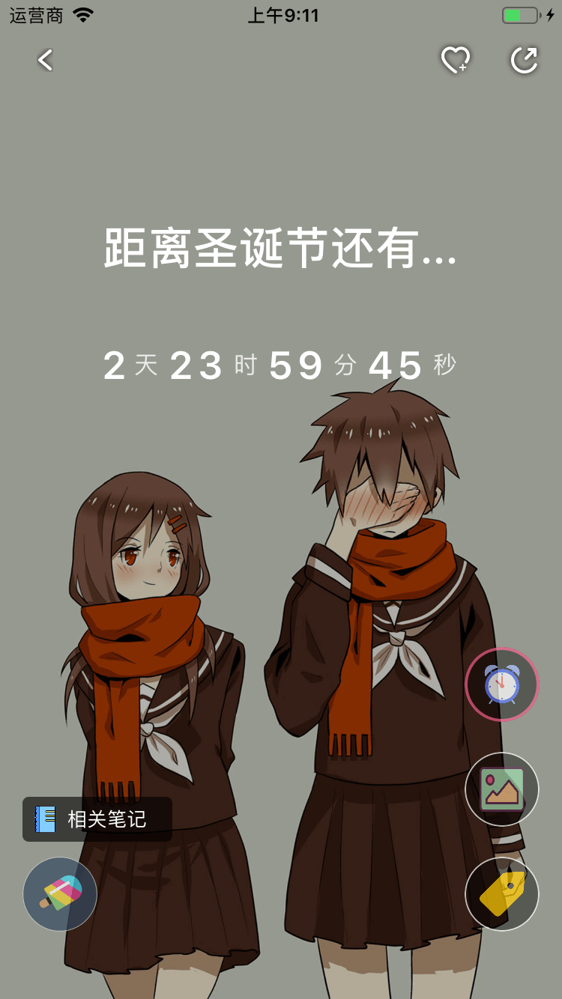
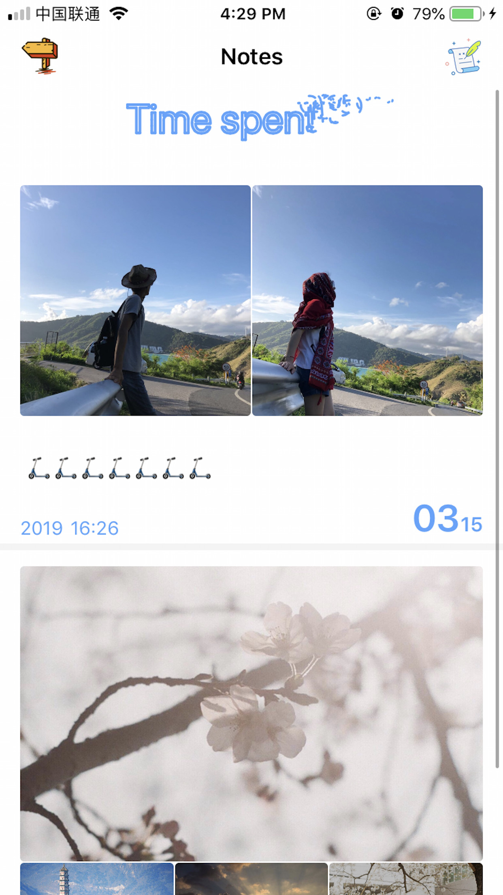
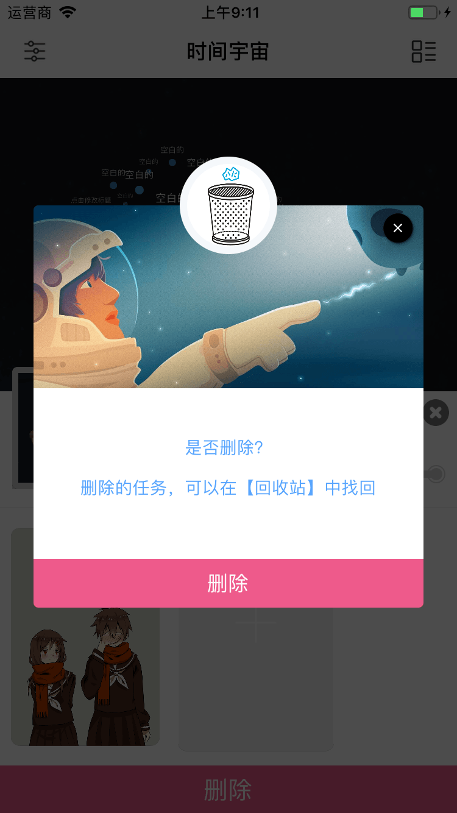
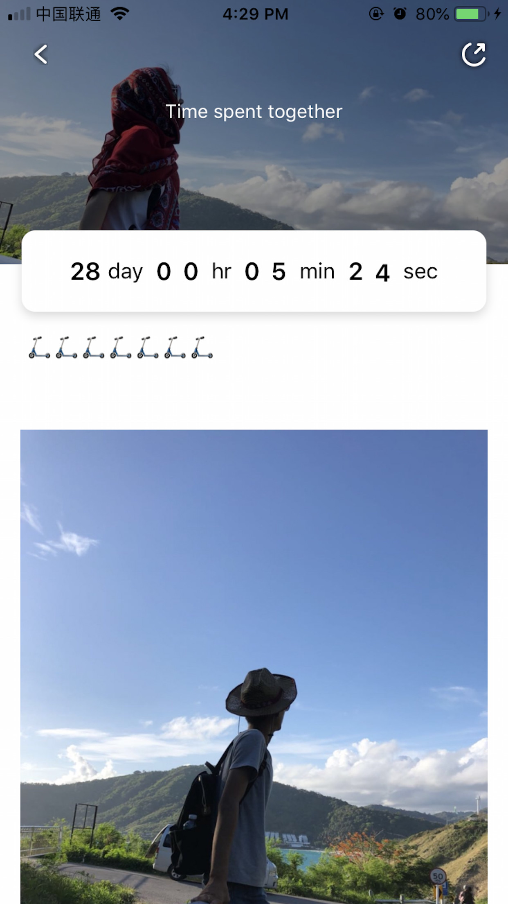
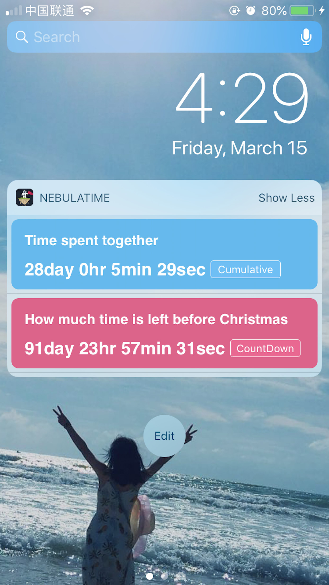

# iOS-DAudiobook

[](LICENSE)
[](https://github.com/kevindcw/DProgram_ios/commits/master)
[](https://github.com/kevindcw/DProgram_ios)


## 效果图：
目前主要功能就是时间计时或者倒计时，关联笔记加通知栏小组件：

<p align="center">
  
  
  
</p>

<p align="center">
  
  
  
</p>


## 实现动态图(文件大，可能要等待5秒)：
<video id="video" controls="" preload="none"
        poster="http://media.w3.org/2010/05/sintel/poster.png">
         <source id="mp4" src="http://media.w3.org/2010/05/sintel/trailer.mp4" 
             type="video/mp4">
          <source id="webm" src="http://media.w3.org/2010/05/sintel/trailer.webm" 
              type="video/webm">
          <source id="ogv" src="http://media.w3.org/2010/05/sintel/trailer.ogv" 
              type="video/ogg">
          <p>Your user agent does not support the HTML5 Video element.</p>
 </video>


## 用到的第三方SDK：
Bmob后端云       （主要用于，用户的登录注册和论坛的发布）
Bmob推送         （用于推送信息到手机）
Bugly腾讯         (腾讯bug收集， 用于收集和分析应用的卡顿和崩溃，以及用户的留存)
友盟              (用于第三方登录和分享，如QQ，微信等)
腾讯广告           (应用内加广告，增加个人开发者收入)


## 代码结构：
好多方法的实现，都是放在根视图里了


####4.点击推送控制跳转的页面
在networkDidReceiveMessage函数里处理得到的参数，
来确定跳转的页面
注意设置角标，不过好像第一次点进角标不会消失，再点才会，好像简书的也是这样（不知道是不是错觉）

```
- (void)application:(UIApplication *)application
didReceiveRemoteNotification:(NSDictionary *)userInfo {
    if (userInfos==nil) {
        userInfos =userInfo ;
//        通知方法回调：接受自定义消息 
        [self networkDidReceiveMessage:userInfos];
    }
    
    [JPUSHService handleRemoteNotification:userInfo];
    [JPUSHService setBadge:0];// 设置角标(到服务器)
   
    
}


```
